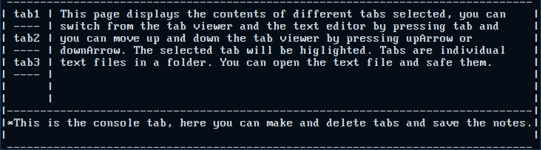

# Terminote_NoteTaker

Terminate is a notetaking program in the terminal made in the c++ language, the goal is to create a notetaking program, with a built-in text editor and a tree viewer of all tabs of a note, you can switch between the tabs and text editor using left-tab. It will also have a command window to make new tabs and save files. This is a picture of what it should look like: 
